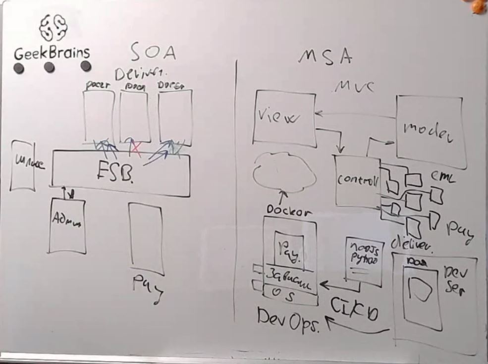
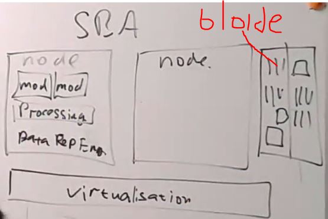
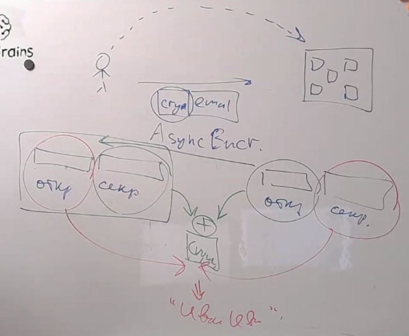
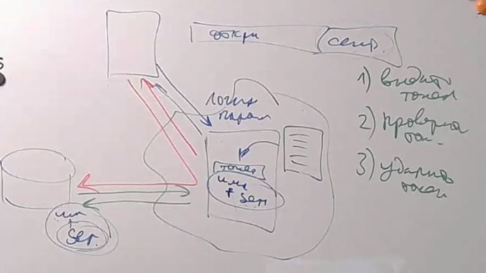
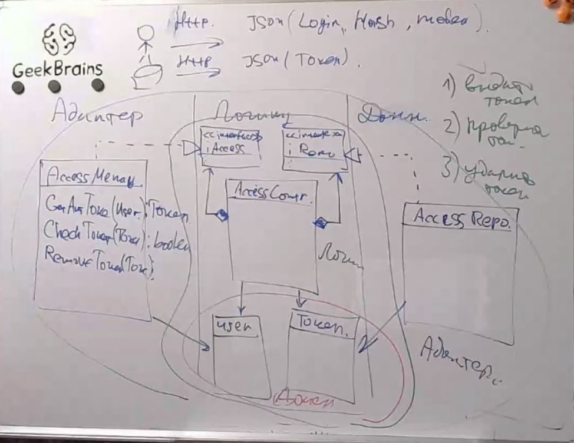
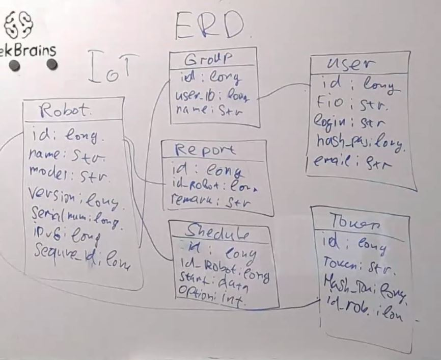
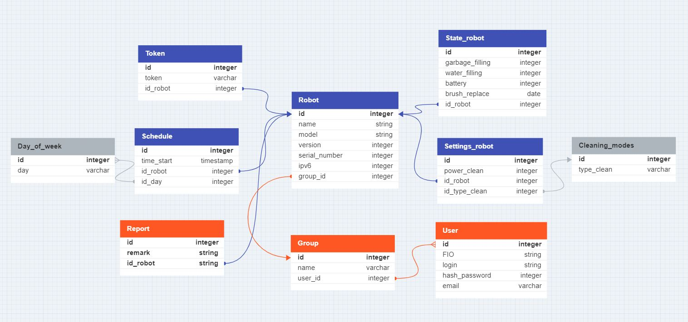
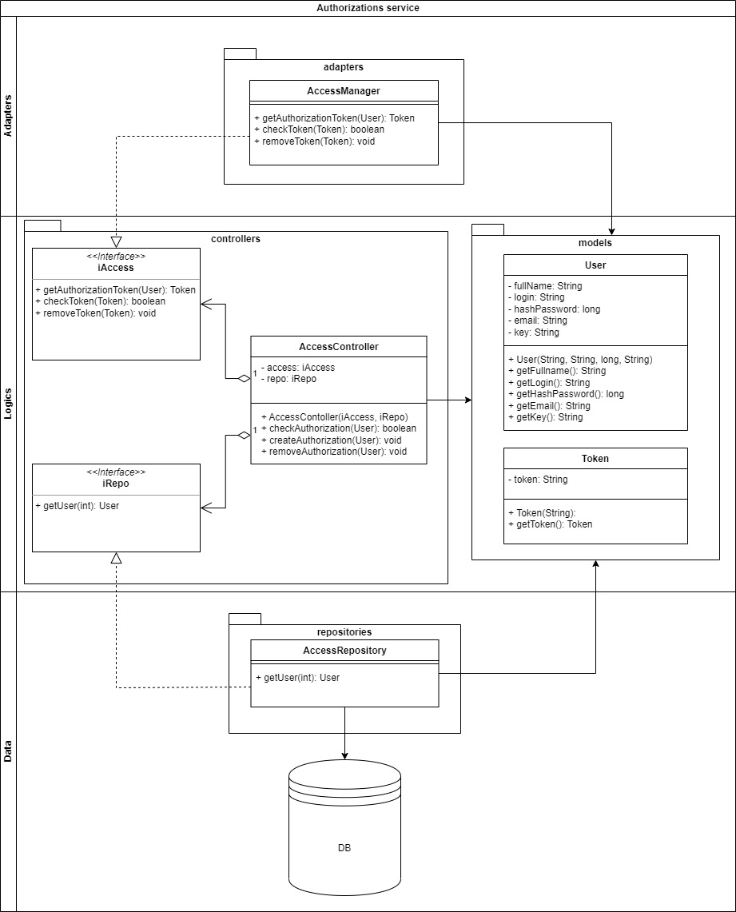

# Урок 11. Сервис-ориентированные архитектуры
## Classwork
### SOA(сервис орентированная архитектура) and MSA(микро сервисная архитектура)

### SBA (с использованием node)

### Технология электронной подписи

### Технология аутентификации робота-пылесоса и пользователя(токен) 

### Прототип UML-диаграммы микро сервиса аутентификации на основе токенов безопасности

### Прототип ERD-диаграммы приложения робота-пылесоса

## Homework
Для проекта системы управления роботом-пылесосом разработать:
1) ERD диаграмму данных хранимых в облаке:

ERD_robot_vacuum_cleaner

2) OPENAPI команды PUT, GET, DELETE, POST для сущностей User, Group, Robot, Shedule(только не хватающие команды. 
Файл с openApi приложен к материалам семинара)
3) Доделать UML диаграмму микро сервиса аутентификации на основе токенов безопасности.

UML_micro_authentication_service

